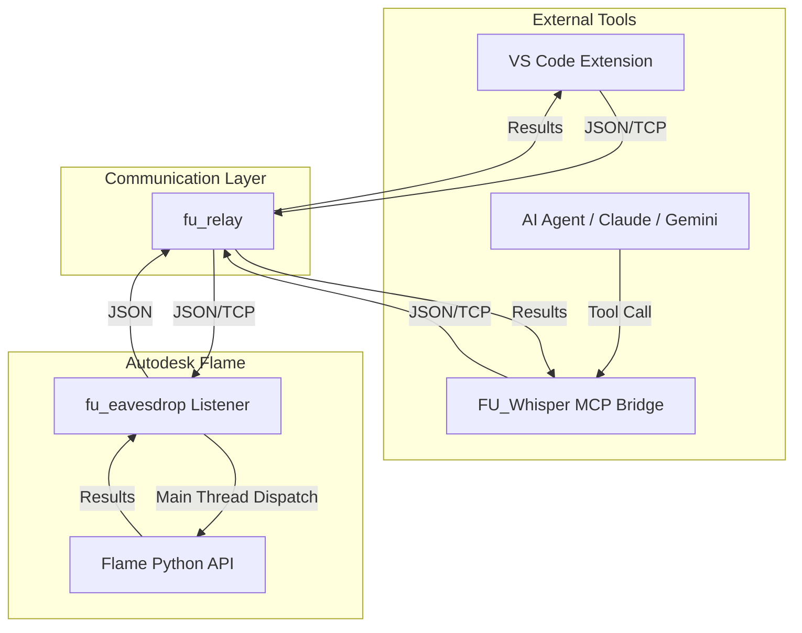

# Architecture: FLAME-UTILITIES

The **FLAME-UTILITIES** suite uses a decoupled bridge architecture consisting of four core components:

*   **fu_eavesdrop** (inside Flame): A high-performance JSON-over-TCP service that executes Python code on the Flame main thread and returns results.
*   **fu_whisper** (MCP Bridge): An AI-native gateway using the Model Context Protocol (MCP) that allows Large Language Models to autonomously interact with the Flame API.
*   **fu_relay**: The secure communication conduit that manages TCP handshakes, token authentication, and data routing between the external tools and the internal listener.
*   **VS Code Extension**: A traditional IDE bridge for human developers to execute selections and manage Flame projects from within VS Code.

## Threading and Execution Model

All calls to the Flame Python API must be executed on Flame's **main UI thread**. 

`fu_eavesdrop` receives code fragments and automatically schedules their execution using `flame.schedule_idle_event()` (or equivalent). This prevents the application from crashing due to non-thread-safe API access from the background TCP listener thread.

## Security and Lifecycle

*   **Local Access:** Services bind to `127.0.0.1` by default to ensure only local tools can access the Flame API.
*   **Token Authentication:** All incoming requests must provide a valid `token` matching the one stored in `.flame.secrets.json`.
*   **Automated Startup:** `fu_eavesdrop` is initialized by `fu_eavesdrop_init.py`, which is loaded by Flame's global or project-specific startup hook mechanism.

## Component Map

