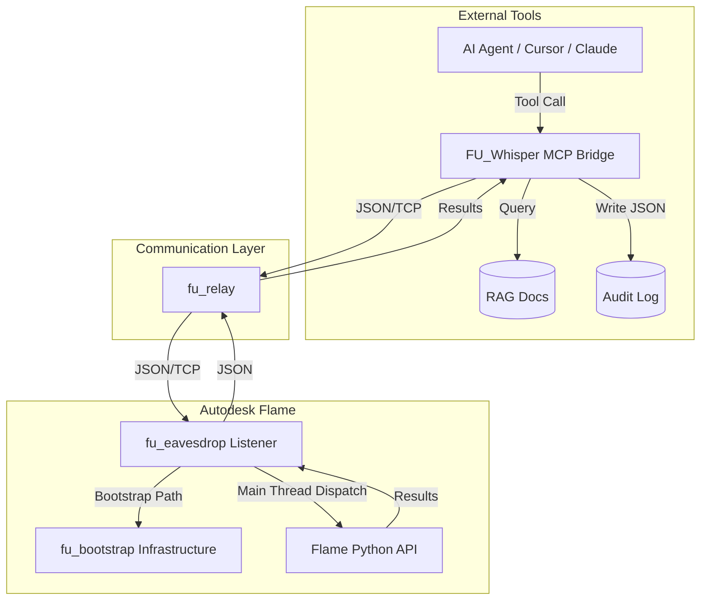

# Architecture: FLAME-UTILITIES

The **FLAME-UTILITIES** suite uses a decoupled bridge architecture consisting of six core components:

*   **fu_bootstrap**: The foundational infrastructure layer that resolves paths and enables direct imports across the toolkit, bypassing Flame's `__init__.py` constraints.
*   **fu_eavesdrop** (inside Flame): A high-performance JSON-over-TCP service located in `service/` that executes Python code on the Flame main thread.
*   **fu_whisper** (MCP Bridge): An AI-native gateway using the Model Context Protocol (MCP) that allows Large Language Models to autonomously interact with the Flame API.
*   **fu_relay**: The secure communication conduit managing TCP handshakes and data routing.
*   **Knowledge Layer (RAG)**: A vector database (`chroma_db`) containing Flame API documentation and research insights, accessible via `fu_whisper`.
*   **Audit Logger**: A persistent system that captures conversation JSON for security and debugging.

## Threading and Execution Model

All calls to the Flame Python API must be executed on Flame's **main UI thread**. 

`fu_eavesdrop` receives code fragments and automatically schedules their execution using `flame.schedule_idle_event()`. This prevents the application from crashing due to non-thread-safe API access from the background TCP listener thread.

## The Bootstrap Pattern

Because Autodesk Flame prohibits traditional Python packages, the toolkit uses `fu_bootstrap.py`. This utility is imported by all internal scripts to:
1.  Discover the absolute location of the `flame-utilities` folder.
2.  Inject `src/`, `lib/`, and `service/` into `sys.path`.
3.  Load configuration files from the `config/` directory.

## Component Map

---
*Note: The legacy VS Code Extension has been moved to `unused/`.*