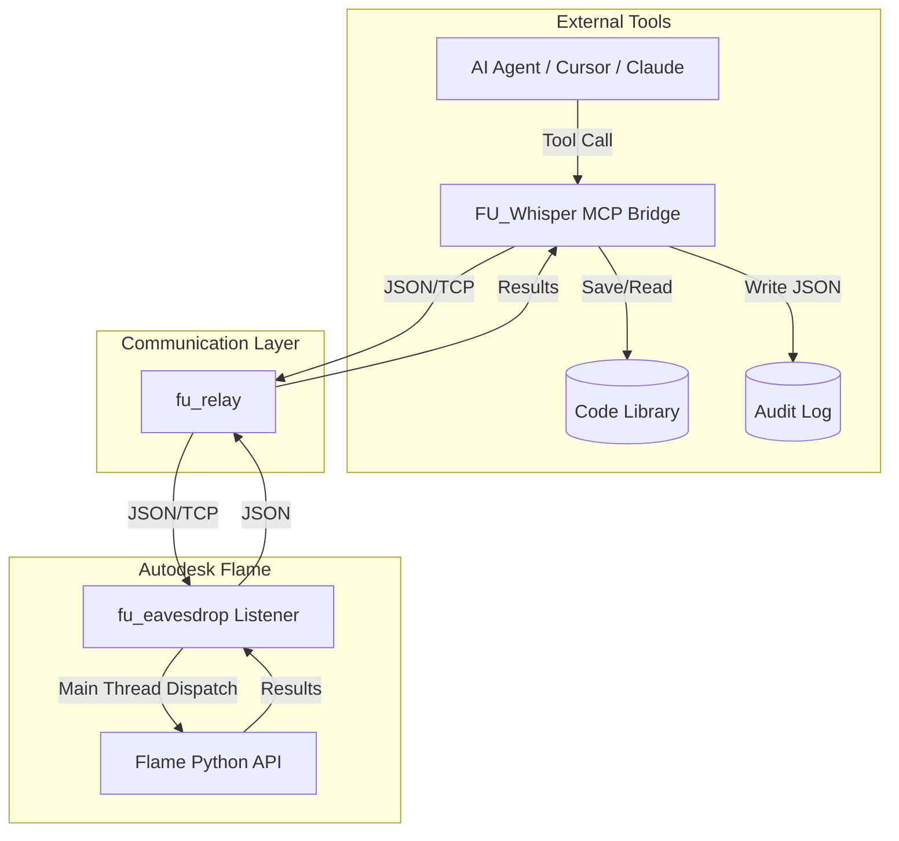

# Architecture: FLAME-UTILITIES

The **FLAME-UTILITIES** suite uses a decoupled bridge architecture consisting of five core components:

*   **fu_eavesdrop** (inside Flame): A high-performance JSON-over-TCP service that executes Python code on the Flame main thread and returns results.
*   **fu_whisper** (MCP Bridge): An AI-native gateway using the Model Context Protocol (MCP) that allows Large Language Models to autonomously interact with the Flame API.
*   **fu_relay**: The secure communication conduit that manages TCP handshakes, token authentication, and data routing between the external tools and the internal listener.
*   **Audit Logger**: A persistent logging system that captures full conversation JSON for security auditing and debugging.
*   **Persistent Code Library**: A local repository of successful Python snippets, allowing the AI to build up and reuse its own toolset over time.

## Threading and Execution Model

All calls to the Flame Python API must be executed on Flame's **main UI thread**. 

`fu_eavesdrop` receives code fragments and automatically schedules their execution using `flame.schedule_idle_event()`. This prevents the application from crashing due to non-thread-safe API access from the background TCP listener thread.

## Intelligence and Persistence

The system is designed to be self-learning:
1.  **Exploration:** The AI uses `inspect_symbol` and `execute_python` to probe the Flame environment.
2.  **Success Logging:** When a complex task is completed successfully, the resulting code is saved to the **Code Library**.
3.  **Auditability:** Every tool call and response is recorded in the **Audit Log**, ensuring a complete history of AI-driven changes to the project.

## Component Map

---
*Note: The legacy VS Code Extension has been moved to `unused/`.*