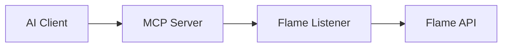

# Goal: The Flame-MCP Bridge

## Vision
To evolve `VSCODE-CONNECT-TO-FLAME` from a developer-centric toolset into an **AI-native ecosystem**. By implementing a Model Context Protocol (MCP) server, we allow Large Language Models (LLMs) to interact with Autodesk Flame as if they were a local user, enabling autonomous scripting, live inspection, and real-time debugging.

---

## 1. Architecture: The Bridge Pattern
The implementation will follow a "Relay" architecture, utilizing the existing infrastructure.

1.  **AI Client:** (Claude Desktop, Cursor, Gemini) sends a request.
2.  **MCP Server (New):** A Python process using `fastmcp` that interprets the AI's intent and translates it into Flame-specific commands.
3.  **Flame Listener (Existing):** Receives the Python code from the MCP server and executes it safely on Flame's main thread.
4.  **Autodesk Flame:** The host environment performing the actual work.



---

## 2. Implementation Strategy

### A. Technology Stack
*   **Language:** Python 3.9+ (matching Flame's environment).
*   **Framework:** `fastmcp` for rapid tool definition.
*   **Communication:** `requests` or `httpx` to talk to the existing `flame-listener` REST/Socket endpoint.

### B. Core Toolset (Phase 1)
The AI should have access to these primary "skills":

| Tool Name | Description | Example AI Use Case |
| :--- | :--- | :--- |
| `flame_exec` | Executes raw Python code in Flame. | "Fix the indentation in the current script." |
| `get_context` | Returns current Project/User/Workspace. | "Which project am I currently working in?" |
| `list_media` | Lists clips in the current Desktop/Batch. | "Find all clips labeled 'RETAKE'." |
| `inspect_api` | Queries Flame's internal `dir()` for symbols. | "What properties does a `PySegment` have?" |

---

## 3. High-Level Implementation Plan

### Step 1: Scaffold the MCP Server
Create a dedicated directory `flame-mcp/` containing a `server.py`. This server will run independently of Flame but on the same network.

### Step 2: Define the "Relay" Logic
Implement a standard execution wrapper that sends code to the listener:
```python
def relay_to_flame(code: str):
    # Sends code to localhost:5555
    # Returns stdout/stderr
```

### Step 3: Tool Exposure
Decorate functions with `@mcp.tool()` to make them visible to the LLM.

---

## 4. Key Benefits

### Autonomous Refactoring
Instead of the developer copying code from an AI chat into a file and then running it, the AI can:
1.  Read the current script from Flame.
2.  Rewrite it for optimization.
3.  Push it back into Flame and run it to verify success.

### Intelligent API Discovery
Since the Flame API is proprietary and sometimes poorly documented, the AI can "explore" the API live. If it's unsure how to delete a marker, it can run a tool to inspect the `flame.PyMarker` class dynamically.

### Visual Reasoning (Future)
By adding a `take_screenshot` tool, the AI can "see" the Flame UI, allowing it to assist with UI-heavy tasks like layout alignment or finding specific buttons in the Batch schematic.

---

## 5. Security & Safety (HITL)
To ensure the AI doesn't accidentally delete a whole project, we will maintain a **Human-In-The-Loop (HITL)** approach:
*   The MCP server will log every command it sends to Flame.
*   Destructive commands (e.g., `flame.delete`) will require a confirmation flag or be restricted to specific "Sandbox" volumes.
