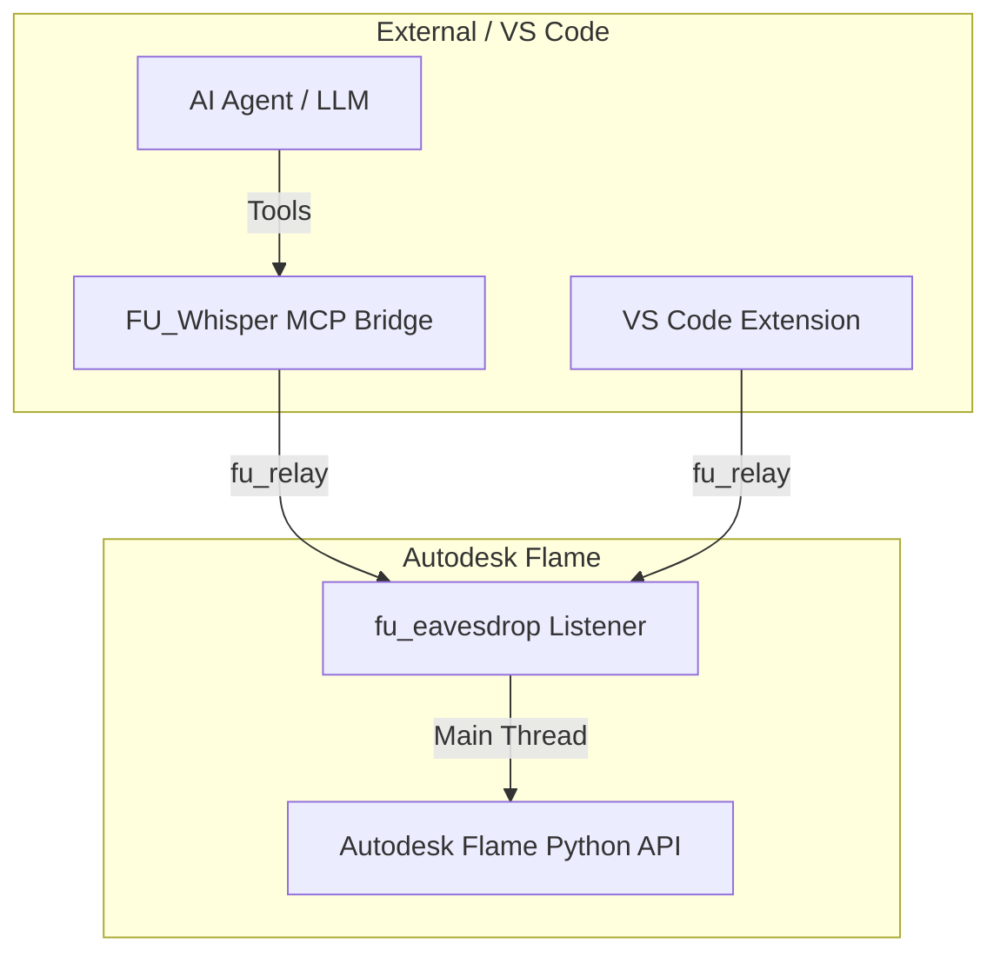

# Vision: FLAME-UTILITIES

The **FLAME-UTILITIES** suite aims to revolutionize Autodesk Flame pipeline development by bridging the gap between Flame's closed environment and modern, AI-augmented workflows. 

## Core Goals

- **AI-Native Interaction**: Leverage the **fu_whisper** bridge to allow AI agents to autonomously inspect, automate, and debug Flame projects in real-time.
- **Rapid Iteration**: Instant execution of Flame scripts from VS Code without application restarts or manual reloading.
- **Deep IntelliSense**: Provide frame-accurate autocompletion and documentation via a fully automated API intelligence pipeline.
- **Enterprise Safety**: Ensure reliability through thread-safe execution and secure, token-based authentication.

## The AI-Augmented Workflow

By implementing the Model Context Protocol (MCP), FLAME-UTILITIES transforms the AI from a simple code generator into an active pipeline participant.

*   **Yesterday**: You ask an AI to write a Renaming script, then copy-paste it into a file and run it.
*   **Today**: You tell the AI, "Rename all segments in the current sequence to match the shot name from their metadata," and the AI executes the task directly inside Flame via **FU_Whisper**.

## Component Overview

## Future Roadmap

1.  **Visual Reasoning**: Integrating screenshot capabilities so AI agents can "see" the Batch schematic and Media Hub.
2.  **Autonomous Conform Suite**: Specialized tools for matching offline edits to high-res sources autonomously.
3.  **Real-Time Debugging**: Full integration of `debugpy` for line-by-line inspection of running hooks.
