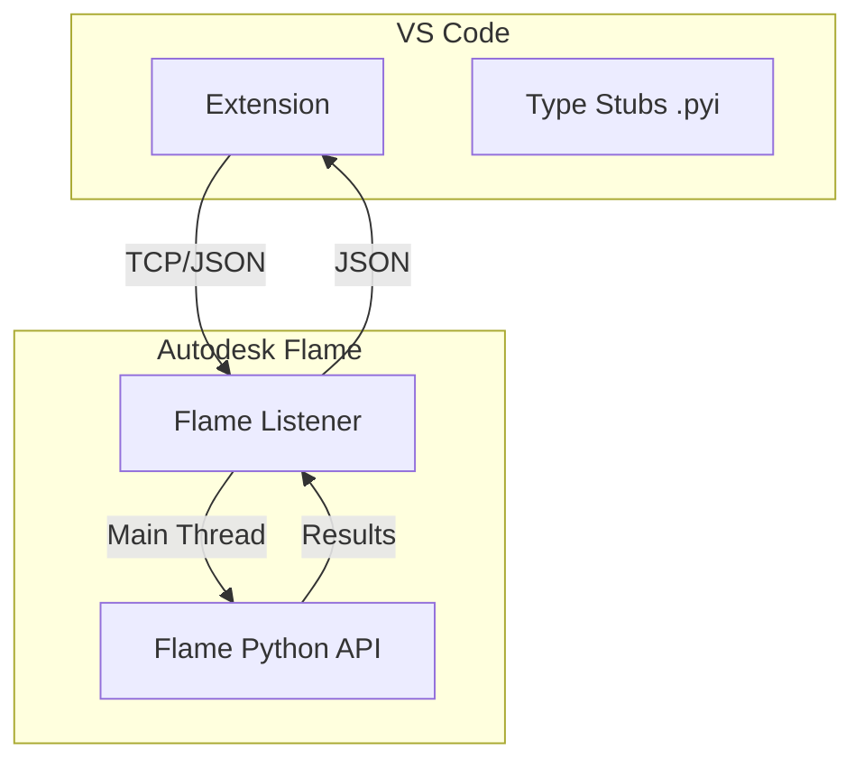

# Vision

The **VSCode-Connect-to-Flame** project aims to bring modern, developer-friendly workflows to Autodesk Flame Python development. By bridging the gap between Flame's closed environment and Visual Studio Code, we enable a rapid iteration loop, deep IntelliSense, and integrated debugging.

## Core Goals

- **Remote Execution:** Execute code directly from VS Code inside a running Flame instance.
- **Deep IntelliSense:** Provide accurate autocompletion and documentation for the Flame API via high-quality type stubs.
- **Integrated Debugging:** Enable line-by-line debugging of Flame scripts using `debugpy`.
- **Automated Documentation:** Maintain a comprehensive API reference that updates automatically with new Flame releases.

## Architecture Overview

The system consists of three primary components:

1.  **Flame Listener (inside Flame):** A Python service that listens for incoming code, executes it safely on the **main UI thread**, and returns results.
2.  **VS Code Extension:** A user-facing bridge that sends code selections or files to the listener and displays output in a dedicated panel.
3.  **API Intelligence Pipeline:** A suite of scripts that crawl the Flame API to generate detailed JSON reports, which are then used to produce Markdown documentation and `.pyi` type stubs.

## MVP Acceptance Criteria

- [x] **Run in Flame:** Execute code in Flame or a mock server.
- [x] **Output Capture:** View `stdout`, `stderr`, and exceptions in VS Code.
- [x] **Main Thread Safety:** Automatic dispatch of API calls to the UI thread.
- [x] **Rich IntelliSense:** Over 2,400 lines of documented stubs.
- [ ] **Remote Debugging:** Full integration with `debugpy` (In Progress).

## Development Philosophy

- **Decoupled Intelligence:** All API knowledge is gathered via automated introspection, ensuring accuracy across different Flame versions.
- **Safety First:** Strict enforcement of main-thread execution to prevent host application crashes.
- **Pragmatic Tooling:** Focus on providing the most impactful features (Execution & IntelliSense) first.