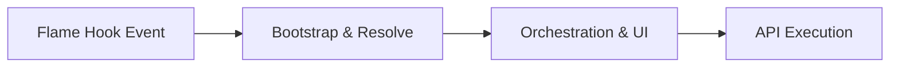
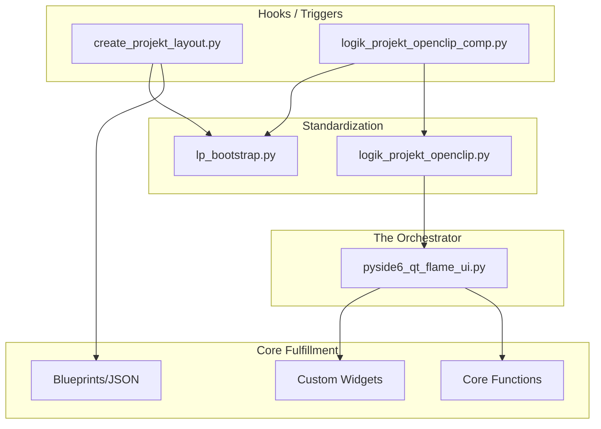

# Process Flow: Logik-Projekt

This document maps the recursive execution flows and import hierarchies of the `logik-projekt` toolset. It explains how a single user action in Flame triggers a chain of events across multiple layers.

## 1. The Core Lifecycle Pattern
Almost every automated process in the toolset follows this four-stage lifecycle:

## 2. Detailed Workflow Maps

### A. Project Layout Initialization
**Trigger**: `hooks/create_projekt_layout.py`

1.  **Stage 1: Environment (Bootstrap)**
    - Injects project root into `sys.path`.
    - Imports `lp_bootstrap` to initialize logging and resource paths.
2.  **Stage 2: Setup (Flame Objects)**
    - Hooks call local functions like `create_or_validate_library()` and `create_or_validate_object()`.
    - Imports `src.core.ui.themes.object_colors` for standardized object coloring.
3.  **Stage 3: Blueprint Loading (JSON Iteration)**
    - Loops through `cfg/library_template_*.json`.
    - Calls `create_and_validate_from_template()`.
    - **Recursive Logic**: Uses `exec()` to dynamically run construct commands for both parent objects and nested "children" objects defined in the JSON.

### B. OpenClip & Batch Automation
**Trigger**: `hooks/logik_projekt_openclip_*.py` (e.g., Comp, Neat Video)

1.  **Stage 1: Specialization**
    - The hook script imports a specialized class from `src/core/logik/logik_projekt_openclip.py`.
2.  **Stage 2: Orchestration (The UI Bridge)**
    - `logik_projekt_openclip.py` acts as a massive orchestrator.
    - **Recursive Imports**: It pulls in 20+ components from `src.core.ui.orchestrators/pyside6_qt_flame_ui.py`, which further imports:
        - **Widgets**: Buttons, Labels, Sliders, Tree Widgets.
        - **Dialogs**: Message, Password, and Progress windows.
        - **Functions**: `flame_importer`, `bookmark_manager`, `pathfinder_abs`.
3.  **Stage 3: Execution**
    - The orchestrator validates the Flame selection (Media Panel vs. Batch).
    - It creates the schematic reels and MUX/Render/Write nodes.

## 3. Dependency Hierarchy (Recursive)

A visualization of how deeply the "Simple" hooks actually reach:

## 4. Why This Matters for Development
- **Bootstrapping is Non-Negotiable**: Every hook must call `lp_bootstrap` before any `src.` import, or the Flame Python environment will fail to locate the library.
- **UI is Centralized**: Modifying `src/core/ui/orchestrators/pyside6_qt_flame_ui.py` updates the interface across **all** OpenClip tools simultaneously.
- **Data-Driven Brushing**: The `exec()` pattern in the layout hook means that adding a new folder to the standard project layout only requires a JSON edit in `cfg/`, not a code change.

---
*Created via Recursive Analysis on 2026-02-03.*
