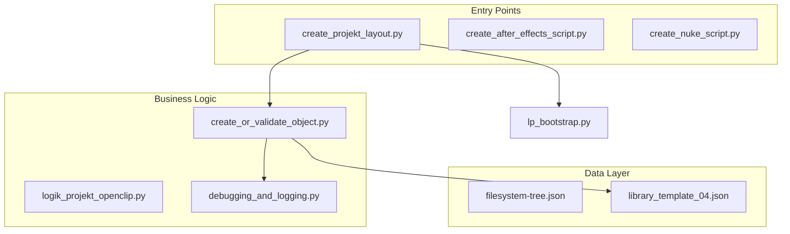

# Static Analysis: Logik-Projekt

This document provides a technical analysis of the `logik-projekt` codebase based on structural relationships and code patterns.

## 1. Path Resolution & Environment
The system relies heavily on manual path injection to overcome the lack of a standard Python package structure (due to Flame constraints).

### LP Bootstrap (`lp_bootstrap.py`)
- **Function**: Standardizes the environment for all hooks.
- **Pattern**: Calculates the project root and injects the `src/` directory into `sys.path`.
- **Status**: Currently being deployed across all `hooks/*.py` files to replace legacy manual path resolution.

### Pathfinder Abs (`src/core/functions/get/pathfinder_abs.py`)
- **Role**: Discovers the absolute paths for key directories (`cfg`, `src`, `pref`).
- **Mechanism**: Navigates the filesystem relative to the location of the core source files.

## 2. Dependency Graph
The following mapping shows the primary dependencies between different layers:

## 3. Code Patterns & Risk Analysis

### Dynamic Execution (`exec`)
- **Usage**: Found in `create_or_validate_object.py`.
- **Logic**: Reads an `object_type` from a JSON template and uses `exec()` to call the corresponding Flame Python API function (e.g., `create_folder`).
- **Risk**: High brittleness. If the API signature changes or the JSON input is malformed, the script will fail at runtime.
- **Recommendation**: Refactor to use `getattr()` or a factory pattern.

### Logging Mechanism
- **Current State**: Uses a custom `debugging_and_logging.py` module.
- **Pattern**: Relies heavily on formatted `print()` statements and custom visual separators.
- **Recommendation**: Transition to the standard Python `logging` library for better integration with external listeners like `fu_eavesdrop`.

---
*Generated via Static Analysis on 2026-02-03.*
